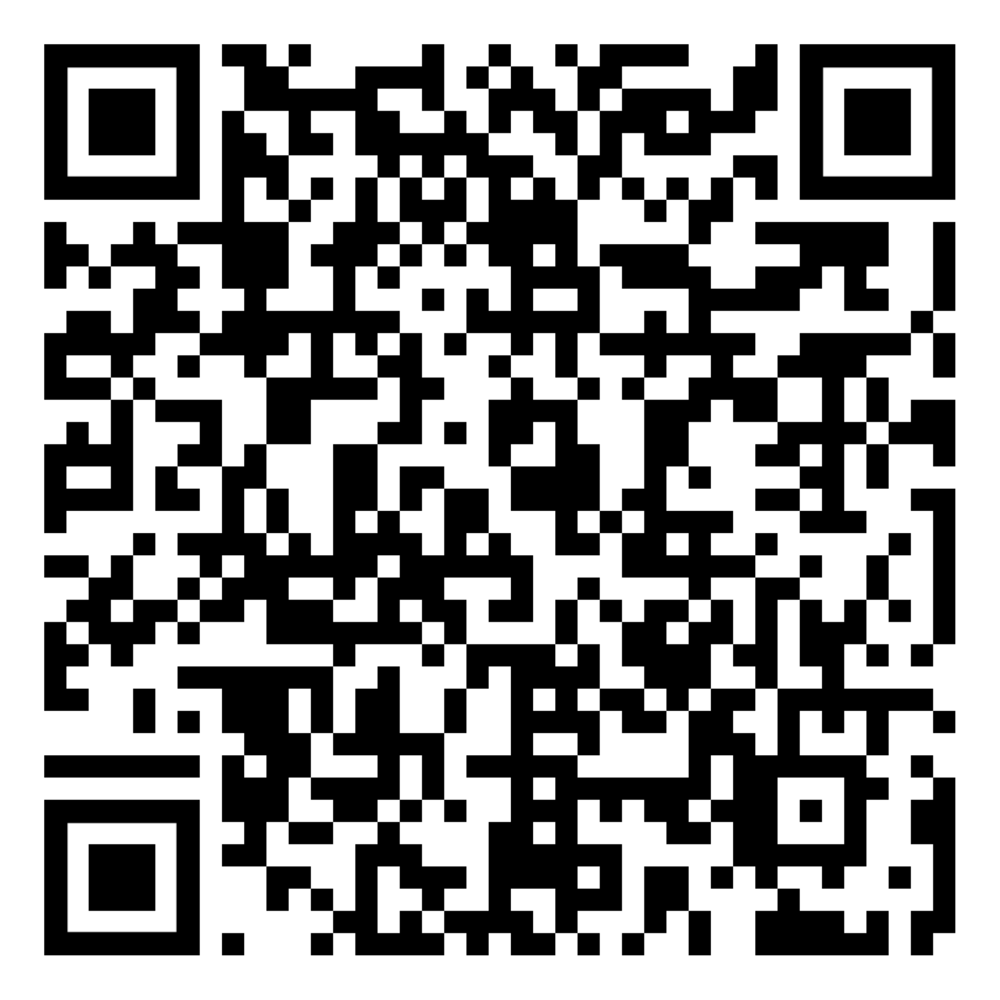

Repository for Exercise 1.2 of Embedded Cryptography Book Section 9

In this exercise, you can play with an MO-TRNG.
By scanning or clicking on the QR-code you can launch the application and observe how the number of oscillators,the jitter variance and the accumulation time affect randomness of the generated numbers. 
The randomness is analyzed by observing the distribution and the auto-correlation of generated 4-bit bit-vectors.

Note: In the case of an ideal RNG, the distribution and the auto-correlation are in 99.9% cases between the red lines.

Your goal is to find the the smallest D, for which the MO-TRNG would not be distinguishable from an ideal RNG.

You should repeat the procedure for all possible &#x3C3tot &#8260 T1 and 	N values.

